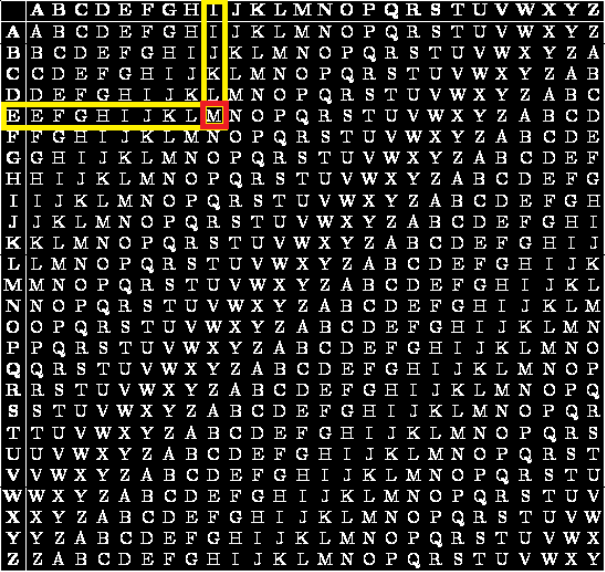
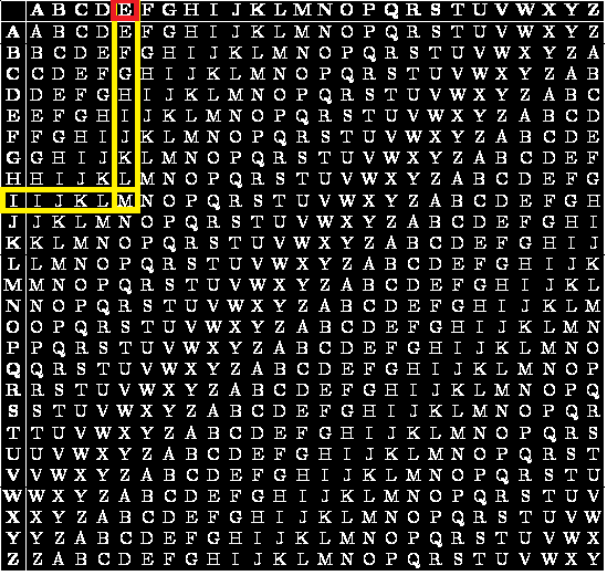
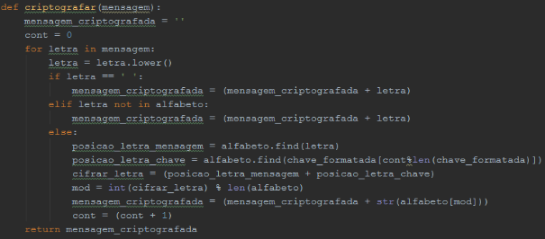
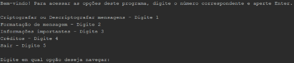
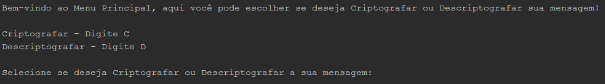
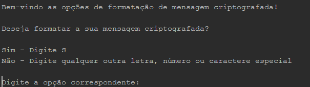
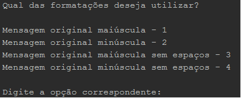
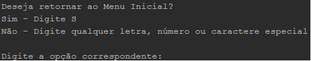
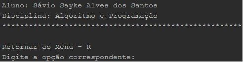
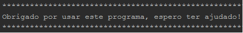

# **Projeto: Criptografia e descriptografia de mensagens utilizando a Cifra de Vigenère**

## Como utilizar/rodar o projeto

Para utilizar este projeto:

1. É preciso ter o [Python](https://www.python.org/downloads/) instalado.

2. Clone esse repositório.
```bash
git clone https://github.com/SavioSayke/Encrypt_Decrypt_Vigerene.git
```

3. Após clonar o repositório, navegue até o diretório dos arquivos pelo seu terminal. Abra seu terminal dentro do diretório do projeto:
    * Para abrir o terminal, navegue até o diretório onde o projeto foi salvo, agora: **segure Shift + botão direito do mouse**. Selecione "Abrir o terminal" ou abra o terminal de sua preferência.

4. Execute o script utilizando:
```bash
python Encrypt_Decrypt_Vigerene.py
```
---

## **Explicação do projeto**

O projeto consiste em criptografar e descriptografar mensagens usando a Cifra de Vigenère, um método que usa uma chave para cifrar e decifrar a mensagem digitada pelo usuário.

Esse método de criptografia foi descrito originalmente pelo criptologista italiano Giovan Battista Bellaso em um livro de 1553 de nome “La cifra del. Sig. Giovan Battista Bellaso”. Curiosamente, o método foi atribuído posteriormente – e de forma errônea – a [**Blaise de Vigenère**](https://en.wikipedia.org/wiki/Blaise_de_Vigen%C3%A8re) (diplomata e criptólogo frânces) no século XIX, e por isso é conhecida até os dias de hoje por “Cifra de Vigenère”.

---

O processo de criptografia é feito da seguinte forma:

1. O usuário irá escrever sua mensagem e uma chave:

   Mensagem: Elaine Professora

   Chave: ifpb

2. Caso a chave não esteja do mesmo tamanho da mensagem a ser cifrada, devemos repetir a chave até que a mensagem e a chave tenham o mesmo tamanho.

Mensagem: E l a i n e P r o f e s s o r a

Chave:         i f p b i f  p b i f p b i f p b

Veja nesse exemplo que agora tanto a mensagem quanto a chave tem o mesmo tamanho, 16 letras.

1. Agora começamos o processo de cifragem. Utilizando a primeira letra da mensagem como coluna e a primeira letra da chave como linha, iremos encontrar na tabela de Vigenère a sua interseção.

Mensagem:				**E** l a i n e P r o f e s s o r a

Chave:					**i** f p b i f  p b i f p b i f p b



Mensagem Criptografada:		**M**

Faremos isso com todas as letras da mensagem até criptografar a mensagem:

Mensagem:				**E** l a i n e P r o f e s s o r a

Chave:					**i** f p b i f  p b i f p b i f p b

Mensagem Criptografada:		**mqpjvj eswkttatgb**

---

O processo de descriptografia é feita da seguinte forma:

1. Utilizamos a primeira letra da chave como linha e procuramos pela primeira letra da mensagem criptografada nessa linha e associamos a coluna a letra da mensagem original.

Chave:					**i**fpbif pbifpbifpb

Mensagem Criptografada:		**m**qpjvj eswkttatgb

Mensagem Descriptografada:	**e**



Faremos isso com todas as letras da mensagem até descriptografar a mensagem:

Chave:					**i**fpbif pbifpbifpb

Mensagem Criptografada:		**m**qpjvj eswkttatgb

Mensagem Descriptografada:	**elaine professora**

**
`Em termos matemáticos podemos expressar a criptografia da seguinte forma:`
**

`	`**C<sub>i</sub> = P<sub>i</sub> + K<sub>i</sub> (mod 26)**

`	`E a descriptografia da seguinte forma:

`	`**P = C – K + 26 (mod 26)**

Onde:

**C** = Texto Cifrado
**P** = Texto Puro
**K** = Chave de Criptografia
**i**  = Índice

O **Operador MOD** é o resto da divisão por 26 que é a quantidade de letras do nosso alfabeto.

---

- **Funcionalidades**

  Além de criptrografar e descriptografar, o projeto ainda contém 4 tipos de formatação de mensagens, que são:

  - Mensagem original maiúscula – após criptografar ou descriptografar a mensagem, caso selecione essa opção, a mensagem ficará inteira com letras maiúsculas.
  - Mensagem original minúscula – após criptografar ou descriptografar a mensagem, caso selecione essa opção, a mensagem ficará inteira com letras minúsculas.
  - Mensagem original maiúscula sem espaços - após criptografar ou descriptografar a mensagem, caso selecione essa opção, a mensagem ficará inteira com letras maiúsculas e sem espaços, ou seja, a mensagem ficará com todas as letras juntas.
  - Mensagem original minúscula sem espaços - após criptografar ou descriptografar a mensagem, caso selecione essa opção, a mensagem ficará inteira com letras minúsculas e sem espaços, ou seja, a mensagem ficará com todas as letras juntas.

- **Explicação detalhada dos trechos mais importantes do programa**

  - Criptografia

    O programa irá receber a mensagem do usuário, formata-la para converter os caracteres especiais e então chamar a função de criptografia:



Após entrar na função, o programa executara um laço para cada letra da mensagem digitada pelo usuário, em seguida, ele verificará os seguintes itens:

- Se a letra for um espaço, ele manterá esse espaço na mensagem após sua criptografia;
- Se a letra não pertencer ao alfabeto brasileiro, ele manterá essa “letra” na mensagem após a criptografia, pois a Cifra de Vigenère não criptografa caracteres não alfabeticos.
- Caso a letra pertença ao alfabeto brasileiro ele iniciará o processo de criptografia dessa letra:

1. Primeiro ele encontrará a posição dessa letra no alfabeto;
2. Em seguida, encontrará a posição da letra da chave de acordo com a posição do contador pelo módulo do tamanho da chave (fazendo assim a chave não exceder o tamanho do texto original);
3. Então ele ira somar as posições encontradas da letra da mensagem com a letra da chave;
4. Depois da soma, o programa irá retirar o módulo desse valor pelo tamanho do alfabeto;
5. Retornando assim o valor da posição da letra criptografada dentro do alfabeto.

Após criptografa-la, irá adicionar a letra a variável **mensagem\_criptografada** e ao final retornará essa variável contendo a mensagem criptografada.

- Descriptografia

  O programa irá receber a mensagem criptografada do usuário, formata-la para converter os caracteres especiais e então chamar a função de descriptografia:


Após entrar na função, o programa executara um laço para cada letra da mensagem criptografada pelo usuário, em seguida, ele verificará os seguintes itens:

- Se a letra for um espaço, ele manterá esse espaço na mensagem após sua criptografia;
- Se a letra não pertencer ao alfabeto brasileiro, ele manterá essa “letra” na mensagem após a descriptografia, pois a Cifra de Vigenère não descriptografa caracteres não alfabeticos.
- Caso a letra pertença ao alfabeto brasileiro ele iniciará o processo de descriptografia dessa letra:

1. Primeiro ele encontrará a posição dessa letra no alfabeto;
2. Em seguida, encontrará a posição da letra da chave de acordo com a posição do contador pelo módulo do tamanho da chave (fazendo assim a chave não exceder o tamanho do texto original);
3. Então ele ira subtrair as posições encontradas da letra da mensagem com a letra da chave e somando por 26 que são o total de letras contido no alfabeto brasileiro;
4. Logo após, o programa irá retirar o módulo desse valor pelo tamanho do alfabeto;
5. Retornando assim o valor da posição da letra descriptografada dentro do alfabeto.

Após descriptografa-la, irá adicionar a letra a variável **mensagem\_descriptografada** e ao final retornará essa variável contendo a mensagem descriptografada.

- **Telas**

- Menu Inicial, onde o usuário poderá navegar pelo programa:



- Menu de Criptografia e Descriptografia:



- Formatação de mensagem criptografada:



- Menu de formatação de mensagem criptografada:



- Retornar ao Menu Inicial:



- Créditos:



- Sair:



- **Conclusão**

  Apesar de simples, a ideia central e objetivo desse projeto é dar inicio ao estudo dos métodos de criptologia e implementa-lo em projetos mais extensos sobre criptografia.